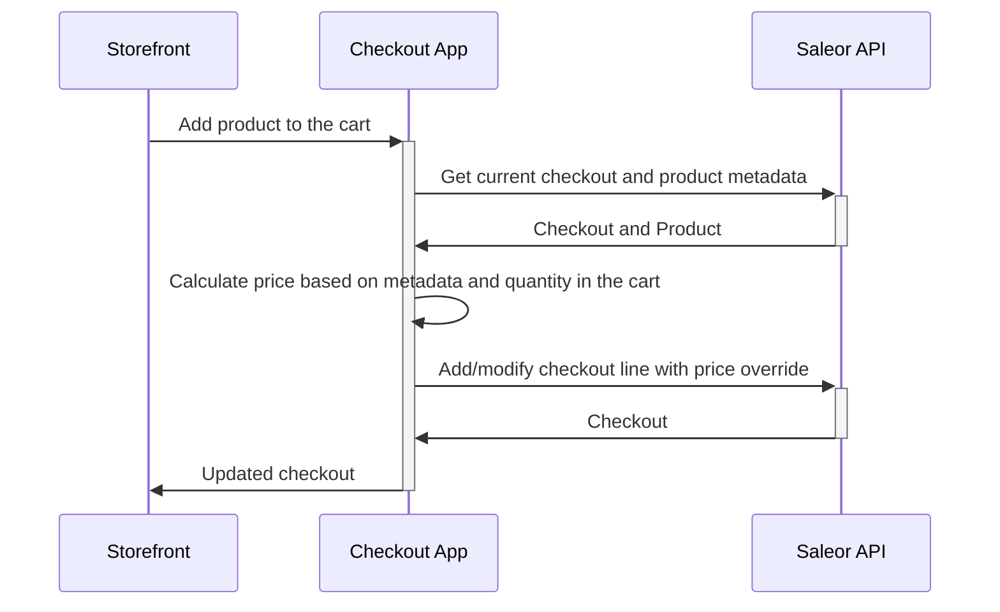

<div align="center">
  <h1>Saleor Checkout Prices App</h1>
  <p>Custom pricing proxy for Saleor with cable configurator support</p>
</div>

## Description

This app enables custom pricing at the checkout level for Saleor, following the official proxy pattern. It includes:

### Original Features
- Public Metadata-based quantity pricing
- Proxy pattern for add-to-cart requests
- Price calculation based on quantity tiers
- Dashboard UI for price management

### Cable Configurator Support ⭐ NEW
- Component-based pricing calculation
- Custom cable configurations with `forceNewLine` support
- Line item metadata for configuration tracking
- Separate line items for each unique cable configuration
- RESTful `/api/add-configured-cable` endpoint

**Required Permission**: `HANDLE_CHECKOUTS` - enables price override at checkout level

### Data flow during adding item to the cart



## Development

### Requirements

Before you start, make sure you have installed:

- [Node.js](https://nodejs.org/en/)
- [pnpm](https://pnpm.io/)

### Starting

1. Install the dependencies by running:

```
pnpm install
```

2. Set environment variables. Rename `.env.example` to `.env.local` and provide URL to the API and channel 

3. Start the local server with:

```
pnpm dev
```

4. Expose local environment using tunnel:
Use tunneling tools like [localtunnel](https://github.com/localtunnel/localtunnel) or [ngrok](https://ngrok.com/).

5. Install the application in your dashboard:

If you use Saleor Cloud or your local server is exposed, you can install your app by following this link:

```
[YOUR_SALEOR_DASHBOARD_URL]/apps/install?manifestUrl=[YOUR_APP_TUNNEL_MANIFEST_URL]
```

This template host manifest at `/api/manifest`

Follow the guide [how to install your app](https://docs.saleor.io/docs/3.x/developer/extending/apps/installing-apps#installation-using-graphql-api) to learn more.

## Docker Deployment (Recommended)

Deploy alongside Saleor platform using Docker:

```bash
# 1. Build and start
docker compose up -d --build

# 2. Install in Saleor
# Open: http://localhost:9000/dashboard/apps/install?manifestUrl=http://checkout-app:3001/api/manifest

# 3. Configure storefront
echo "NEXT_PUBLIC_CHECKOUT_APP_URL=http://localhost:3001" >> ../saleor-storefront/.env
```

## Usage

### Original Quantity Pricing

1. Define quantity based prices:
   - Go to Saleor Dashboard → Apps → "Saleor App Checkout Prices POC"
   - List of 10 first variants will be displayed
   - Set new prices for 5 and 10 pcs, click save
   - Data is stored in product metadata
2. Open storefront page:
   - `http://localhost:3000/storefront`
   - Choose updated variant
   - Add to checkout and see prices change based on quantity

### Cable Configurator

The cable configurator integration is handled automatically:
- Storefront calls `/api/add-configured-cable`
- App fetches component prices
- Calculates total (assembly + connectors + cable type + length)
- Adds line with custom price and metadata
- Uses `forceNewLine: true` for separate line items

